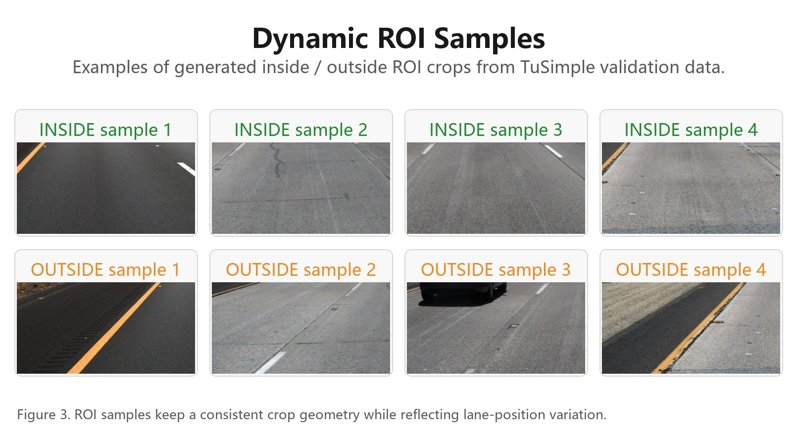
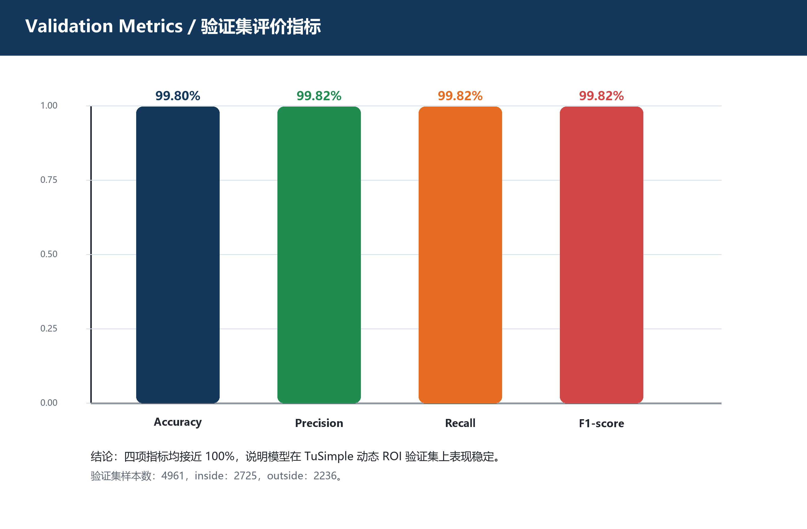
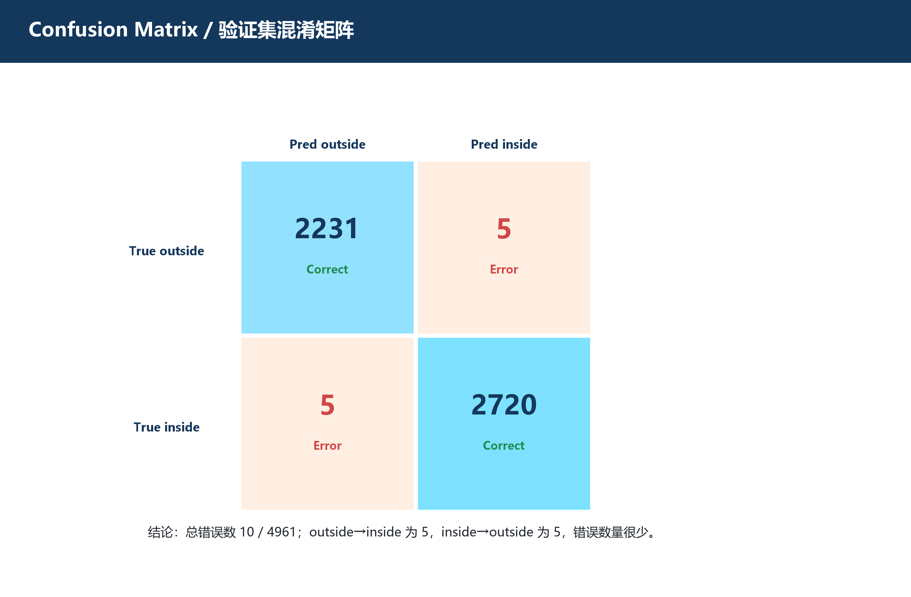
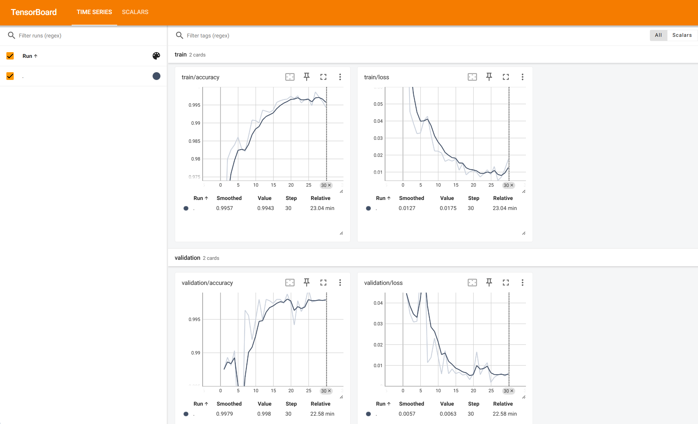
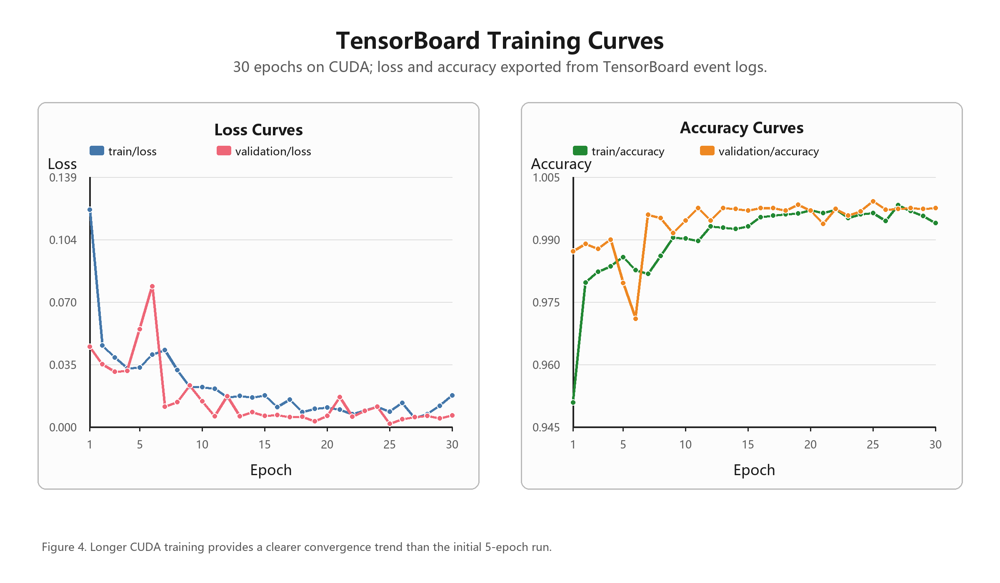
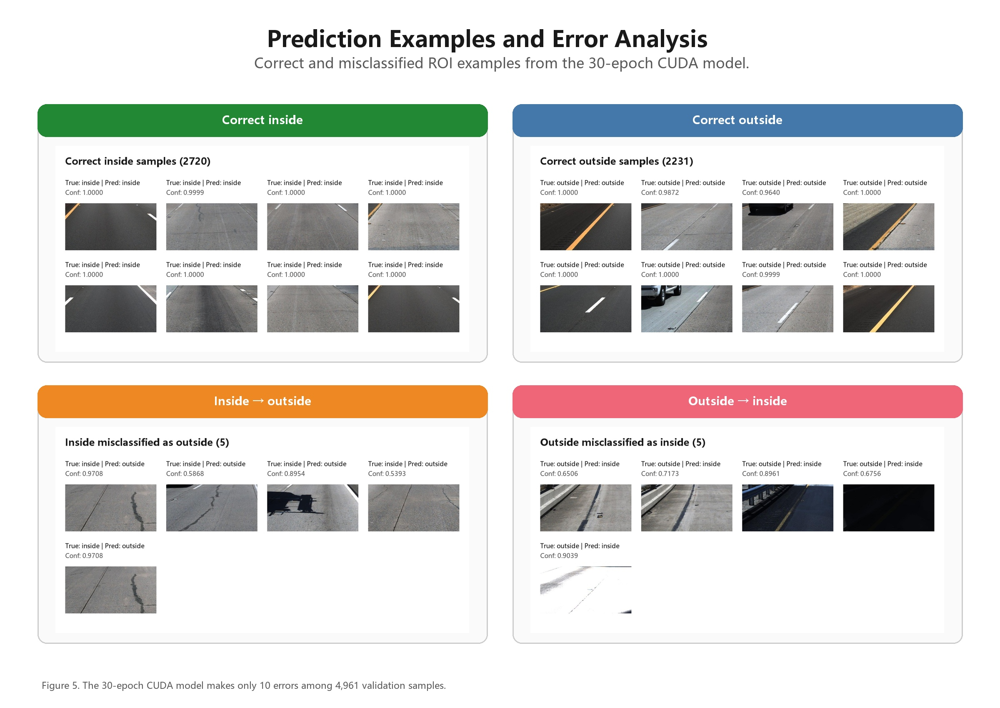
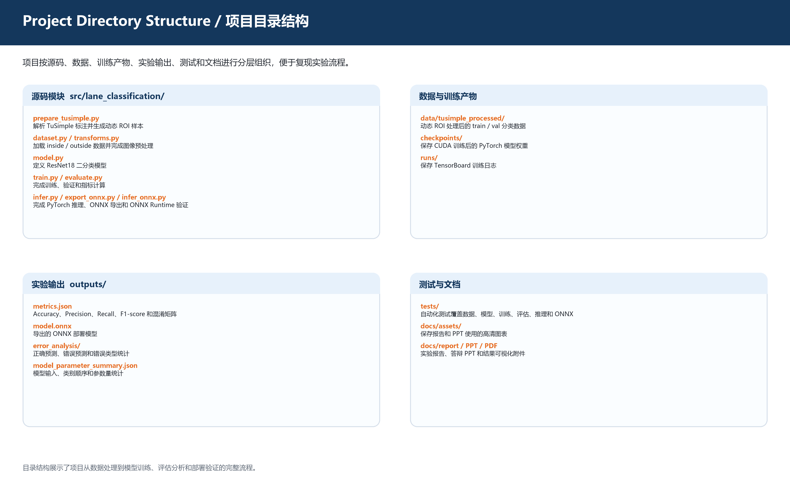
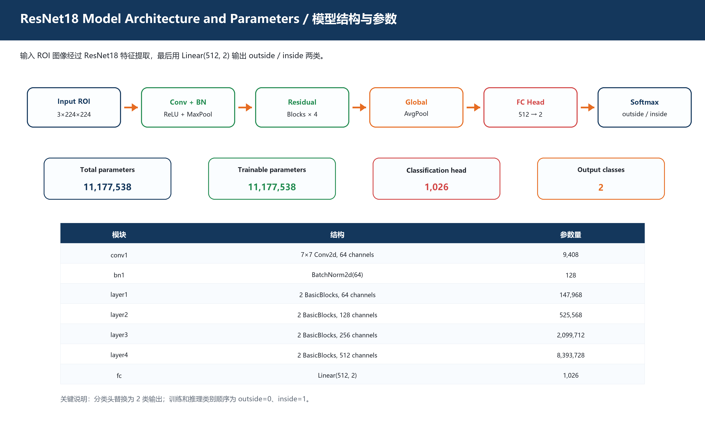

# 车道线二分类感知实验报告

## 摘要

本项目面向自动驾驶基础感知场景，设计并实现了一个基于前视道路图像的“车道内 / 车道外”二分类感知系统。传统车道线检测通常需要输出精确的车道线曲线、实例分割结果或可行驶区域边界，实现复杂度较高；而在部分课程实验、原型验证或基础决策场景中，只需要判断车辆前方某一区域是否位于主车道范围内。因此，本项目将车道感知问题转化为一个图像二分类任务：输入车辆前方 ROI 图像，输出该区域属于 `inside` 还是 `outside`。

实验使用 TuSimple Lane Detection 数据集作为主要数据来源。由于 TuSimple 原始数据集提供的是车道线坐标标注，并不直接包含车道内 / 车道外分类标签，因此本项目基于车道线坐标自动构造二分类样本。为了避免固定 ROI 无法适应不同图像中车道位置变化的问题，项目实现了基于车道线插值和主车道边界估计的动态 ROI 生成策略。随后，使用 PyTorch 和 ResNet18 构建二分类模型，并完成训练、评估、TensorBoard 可视化、PyTorch 单图推理、ONNX 模型导出和 ONNX Runtime 推理验证。

在 TuSimple 动态 ROI 验证集上，模型取得了较好的实验结果：Accuracy 达到 **99.80%**，F1-score 达到 **99.82%**。同时，PyTorch 推理和 ONNX Runtime 推理在同一测试样本上的输出类别一致，置信度几乎完全相同，说明模型导出后推理结果保持稳定。整体来看，本项目完成了从数据预处理、样本构造、模型训练、指标评估到部署验证的完整流程，符合课程项目对车道线二分类感知系统的功能要求。

---

## 1. 实验背景与目的

### 1.1 实验背景

车道线感知是自动驾驶环境感知中的重要组成部分。传统车道线检测任务通常要求模型从前视图像中检测出多条车道线，并输出车道线的精确位置或曲线形状。这类方法虽然能够提供更细粒度的道路结构信息，但也存在实现流程复杂、标注处理繁琐、后处理成本较高等问题。

在一些基础自动驾驶实验或课程项目中，系统并不一定需要完整恢复所有车道线，只需要判断车辆前方感兴趣区域是否处于主车道范围内。例如，在一个简化的感知决策流程中，模型可以先判断当前 ROI 是否属于车道内区域，再将该结果作为后续控制或风险判断的基础输入。

因此，本项目将复杂的车道线检测问题简化为二分类任务：给定一张车辆前方 ROI 图像，判断该区域属于车道内还是车道外。该任务能够覆盖深度学习项目中的关键环节，包括数据集解析、标签构造、图像预处理、模型训练、指标评估、可视化分析和模型部署。

### 1.2 实验目的

本实验的主要目标如下：

1. 使用 TuSimple 车道线数据集构造车道内 / 车道外二分类样本。
2. 设计合理的 ROI 选取策略，使样本能够反映真实车道位置变化。
3. 使用 ResNet18 搭建二分类模型，实现对 ROI 图像的 inside / outside 判断。
4. 完成模型训练、验证集评估和错误样例分析。
5. 使用 TensorBoard 记录训练过程，观察 loss 和 accuracy 曲线变化。
6. 将 PyTorch 模型导出为 ONNX 格式，并使用 ONNX Runtime 验证推理一致性。
7. 形成一套可复现、可展示、符合课程要求的车道线二分类感知实验流程。

---

## 2. 数据集介绍

### 2.1 TuSimple 数据集

本实验使用 TuSimple Lane Detection 数据集。TuSimple 是常用的车道线检测数据集之一，包含大量前视道路图像以及对应的车道线坐标标注。每条标注记录通常包含以下字段：

- `raw_file`：原始图像相对路径。
- `lanes`：多条车道线在不同高度采样点上的横坐标。
- `h_samples`：车道线横坐标对应的纵坐标采样位置。

TuSimple 原始任务是车道线检测，因此它提供的是车道线位置标注，而不是直接的分类标签。为了完成本项目的二分类任务，需要根据车道线坐标自动构造 `inside` 和 `outside` 样本。

### 2.2 原始标注与二分类任务的差异

原始 TuSimple 标注描述的是图像中车道线的位置，例如在多个固定高度处给出车道线的横坐标。该信息适合用于训练车道线检测模型，但本项目的目标是判断 ROI 是否位于主车道内。因此，需要完成从“车道线坐标标注”到“ROI 分类标签”的转换。

转换的关键问题包括：

1. 如何确定主车道的左右边界。
2. 如何选择 ROI 的位置和大小。
3. 如何判断一个 ROI 属于车道内还是车道外。
4. 如何避免固定裁剪区域造成样本不准确或模型学习到无关特征。

为了解决这些问题，本项目实现了基于车道线插值的动态 ROI 构造方法。

---

## 3. 数据预处理与样本构造

### 3.1 数据处理总体流程

数据预处理流程如下：

```text
TuSimple 原始图像与 JSON 标注
        ↓
解析 raw_file、lanes、h_samples
        ↓
过滤无效车道线坐标
        ↓
在指定高度 target_y 上插值计算车道线 x 坐标
        ↓
选择车辆中心附近的左右主车道边界
        ↓
基于主车道中心动态生成 inside / outside ROI
        ↓
裁剪 ROI 并保存为分类样本
        ↓
形成 train / val 数据目录
```

最终生成的数据目录结构如下：

```text
data/tusimple_processed/
  train/
    inside/
    outside/
  val/
    inside/
    outside/
```

其中，`inside` 表示 ROI 中心位于主车道左右边界之间，`outside` 表示 ROI 中心位于主车道边界外侧。

### 3.2 动态 ROI 设计原因

在实验早期，如果直接采用固定 ROI，例如固定裁剪图像下方某一区域，会存在明显问题：不同图像中车道位置、车辆相对道路中心的位置、车道线弯曲情况并不完全一致。固定 ROI 在某些图像中可能覆盖主车道区域，在另一些图像中则可能偏离车道中心，导致标签不准确。

此外，如果 inside 和 outside 样本使用不同尺寸或明显不同位置的裁剪方式，模型可能学习到裁剪几何特征，而不是真正学习车道内外的视觉语义。为了降低这类数据泄漏风险，本项目最终采用动态 ROI 策略，并保证生成的 ROI 尺寸一致。

动态 ROI 的优势包括：

1. 能够根据每张图像的实际车道线位置调整 ROI。
2. 更适合处理不同道路场景和车道中心偏移。
3. 避免固定 ROI 对弯道、偏移车辆位置不适应的问题。
4. 保证 inside / outside 样本具有一致的输入尺寸，降低模型利用无关信息作弊的可能性。
5. 更符合“根据车道线标注自动构造二分类样本”的实验要求。

### 3.3 主车道边界确定方法

对于每张 TuSimple 图像，首先读取其车道线标注。TuSimple 中无效横坐标通常使用 `-2` 表示，因此在处理时需要过滤无效点。随后，在指定高度 `target_y` 上对每条有效车道线进行插值，得到该高度处不同车道线的横坐标位置。

在得到多个车道线横坐标后，以图像中心为参考，选择最接近车辆中心线的左右两条车道线作为主车道边界：

- 位于图像中心左侧且距离中心最近的车道线作为左边界。
- 位于图像中心右侧且距离中心最近的车道线作为右边界。

如果无法找到有效的左右边界，则跳过该样本，避免生成低质量或错误标签样本。

### 3.4 inside / outside 标签构造

确定主车道左右边界后，可以得到主车道中心和车道宽度：

```text
lane_center = (left_boundary + right_boundary) / 2
lane_width = right_boundary - left_boundary
```

对于 inside 样本，将 ROI 中心设置在主车道中心附近，使其位于左右边界之间。对于 outside 样本，则将 ROI 中心移动到主车道边界外侧，并再次通过边界判断确认该 ROI 确实属于 outside。

本项目没有简单地把 ROI 强行裁剪到图像范围内，而是对越界样本进行跳过处理。这样可以避免裁剪区域被截断导致输入图像内容不一致，从而提高样本质量。

### 3.5 数据集规模

经过动态 ROI 处理后，最终得到的训练集和验证集样本数量如下：

| 数据集 | inside | outside | 总数 |
|---|---:|---:|---:|
| train | 3561 | 2968 | 6529 |
| val | 2725 | 2236 | 4961 |

从数量上看，inside 和 outside 两类样本较为均衡，虽然 inside 数量略多，但并未出现严重类别不平衡问题，能够支持二分类模型训练和评估。

下图展示了动态 ROI 生成后的部分 inside / outside 样本。可以看到，两类样本都来自真实 TuSimple 道路图像，并且输入尺寸保持一致，这有利于模型学习车道区域的视觉特征，而不是依赖裁剪尺寸等无关因素。



---

## 4. 模型设计

### 4.1 模型选择

本实验选择 ResNet18 作为主模型。ResNet18 是经典的残差卷积神经网络，具有较好的图像特征提取能力，同时网络规模适中，适合课程项目、实验验证和中小规模图像分类任务。

相比从零设计简单 CNN，ResNet18 具有以下优点：

1. 网络结构成熟稳定，适合作为图像分类基线模型。
2. 残差连接能够缓解深层网络训练困难问题。
3. 模型复杂度适中，训练和推理成本相对可控。
4. 在图像分类任务中具有较强的通用特征提取能力。

### 4.2 模型输入与输出

模型输入为裁剪后的 RGB ROI 图像。所有 ROI 图像在送入模型前统一 resize 到 `224 × 224`，并转换为张量形式进行归一化处理。

模型输出为两个类别的 logits，对应关系如下：

```text
outside = 0
inside = 1
```

ResNet18 原始最后一层全连接层用于 ImageNet 多分类任务，本项目将最后的分类头替换为输出 2 个类别的全连接层，从而适配车道内 / 车道外二分类任务。

### 4.3 模型结构流程

整体模型流程如下：

```text
输入 ROI 图像 3 × 224 × 224
        ↓
ResNet18 卷积特征提取
        ↓
全局平均池化
        ↓
二分类全连接层
        ↓
输出 outside / inside logits
        ↓
Softmax 得到类别概率
```

---

## 5. 图像预处理与数据增强

### 5.1 输入预处理

为了保证训练、评估和推理过程输入一致，本项目对 ROI 图像进行统一预处理：

1. 将 ROI 图像转换为 RGB 格式。
2. 将图像 resize 到 `224 × 224`。
3. 转换为 PyTorch Tensor。
4. 使用图像分类常用均值和标准差进行归一化。

统一的预处理流程能够保证训练阶段和推理阶段的数据分布尽量一致，减少由于输入处理不一致造成的预测偏差。

### 5.2 训练阶段数据增强

为了提高模型对光照、颜色和局部变化的鲁棒性，训练阶段使用了图像增强方法，包括：

- 随机水平翻转。
- 随机亮度变化。
- 随机对比度变化。
- 轻微颜色扰动。

这些增强方法能够模拟不同光照条件、道路颜色差异和摄像头采集差异，从而降低模型对单一视觉模式的依赖。

本项目没有使用垂直翻转，因为道路图像具有明显的上下语义结构，垂直翻转会破坏真实道路场景的空间关系，不适合车道线感知任务。

### 5.3 验证阶段处理

验证集不使用随机增强，只进行确定性的 resize、ToTensor 和 normalize。这样可以保证评估结果稳定，并且便于对不同模型或不同训练配置进行公平比较。

---

## 6. 训练配置与实现

### 6.1 训练配置

本实验训练配置如下：

| 配置项 | 内容 |
|---|---|
| 编程语言 | Python |
| 深度学习框架 | PyTorch |
| 主模型 | ResNet18 |
| 输入尺寸 | 224 × 224 |
| 类别数 | 2 |
| 类别名称 | outside, inside |
| 损失函数 | CrossEntropyLoss |
| 优化方法 | Adam / Adam 类优化方法 |
| 日志记录 | TensorBoard |
| 模型保存 | PyTorch checkpoint |
| 部署格式 | ONNX |
| 推理验证 | PyTorch + ONNX Runtime |

训练过程中，模型根据训练集计算损失并更新参数，同时在验证集上计算 accuracy 等指标。训练日志写入 TensorBoard，便于观察训练过程是否正常收敛。

### 6.2 TensorBoard 日志

本项目在训练阶段记录以下指标：

- `train/loss`
- `train/accuracy`
- `validation/loss`
- `validation/accuracy`

通过 TensorBoard 可以观察模型训练过程中的收敛趋势。一般来说，如果训练 loss 持续下降，训练 accuracy 和验证 accuracy 保持较高水平，并且验证指标没有明显崩坏，则说明训练过程基本正常。

### 6.3 实验环境说明

本实验完整训练在 CUDA 环境下完成，主要环境如下：

| 项目 | 版本或配置 |
|---|---|
| Python | 3.12.9 |
| PyTorch | 2.11.0+cu128 |
| torchvision | 0.26.0+cu128 |
| CUDA | 12.8 |
| GPU | NVIDIA GeForce RTX 5060 |
| numpy | 2.4.4 |
| Pillow | 12.2.0 |
| tensorboard | 2.20.0 |
| onnx | 1.21.0 |
| onnxruntime | 1.21.0 |
| pytest | 9.0.3 |

训练脚本可通过 `--device cuda` 使用 GPU 加速；如果只验证项目流程，也可以在 CPU 环境下运行一键 smoke pipeline。

---

## 7. 实验结果与指标分析

### 7.1 验证集整体结果

模型训练完成后，在 TuSimple 动态 ROI 验证集上进行评估。验证集共包含 4961 张 ROI 图像，其中 inside 类 2725 张，outside 类 2236 张。

最终评估结果如下：

| 指标 | 数值 |
|:--|:---|
| Accuracy | 0.9980 |
| Precision | 0.9982 |
| Recall | 0.9982 |
| F1-score | 0.9982 |
| 验证集样本数 | 4961 |

从指标可以看出，模型在验证集上取得了较高的分类准确率和 F1-score，说明模型能够较好地区分基于 TuSimple 动态 ROI 构造的车道内和车道外样本。

下图将 Accuracy、Precision、Recall 和 F1-score 进行可视化展示。四项指标均接近 1.0，说明模型在当前验证集上具有较好的整体分类能力。



### 7.2 混淆矩阵

验证集混淆矩阵如下：

```text
               Pred outside   Pred inside
True outside        2231             5
True inside           5          2720
```

对应的混淆矩阵图如下：



根据混淆矩阵可以得到以下结论：

1. outside 类共有 2236 个样本，其中 2231 个预测正确，只有 5 个被误判为 inside。
2. inside 类共有 2725 个样本，其中 2720 个预测正确，5 个被误判为 outside。
3. 模型整体误判数量较少，分类效果较好。
4. 模型对 outside 类的误判尤其少，说明模型较少把车道外区域错误判断为车道内区域。

### 7.3 指标解释

Accuracy 表示所有样本中预测正确的比例，本实验中 Accuracy 为 99.80%，说明模型在验证集上的总体分类正确率较高。

Precision 表示被模型预测为 inside 的样本中，真实为 inside 的比例。本实验 Precision 为 99.82%，说明模型预测 inside 时通常比较可靠。

Recall 表示真实 inside 样本中被模型正确识别出来的比例。本实验 Recall 为 99.82%，说明绝大多数车道内样本能够被正确识别。

F1-score 综合考虑 Precision 和 Recall，本实验 F1-score 为 99.82%，说明模型在类别识别上整体表现均衡。

---

## 8. TensorBoard 曲线分析

训练过程中使用 TensorBoard 记录 loss 和 accuracy 曲线。根据训练曲线可以观察到，训练 loss 整体下降，训练 accuracy 和验证 accuracy 维持在较高水平，说明模型训练过程正常。

下图为从 TensorBoard 日志中导出的训练曲线，包括训练 / 验证 loss 和训练 / 验证 accuracy。该图可以作为报告中证明训练过程可追踪、可视化和可复现的重要依据。



验证 accuracy 曲线中存在一定波动，这是深度学习训练中常见现象，并不一定表示模型存在问题。造成波动的原因主要包括：

1. 训练轮数有限，单个 epoch 的变化会在曲线上表现得比较明显。
2. 验证集中存在边界样本、阴影样本、车道线模糊样本等较难分类的情况。
3. TensorBoard 曲线如果纵轴范围较窄，小幅数值变化会在视觉上被放大，看起来像变化较大。
4. 数据加载顺序、模型参数更新和训练随机性都会造成曲线轻微波动。

因此，不能只根据曲线是否完全平滑来判断模型好坏。更合理的判断方式是结合最终验证集指标、混淆矩阵和错误样例分析。从本实验结果来看，验证集 Accuracy 和 F1-score 都较高，混淆矩阵中的错误数量也较少，因此当前模型已经能够满足本项目的实验目标。



---

## 9. 错误样例分析

### 9.1 错误类型统计

为了更深入分析模型表现，本项目对验证集预测结果进行了错误样例统计，并生成了正确预测和错误预测的可视化样例。

错误分析结果如下：

| 类型 | 数量 |
|---|---:|
| correct inside | 2720 |
| correct outside | 2231 |
| inside → outside | 5 |
| outside → inside | 5 |

其中：

- `correct inside` 表示真实为 inside 且预测为 inside。
- `correct outside` 表示真实为 outside 且预测为 outside。
- `inside → outside` 表示真实为 inside，但模型误判为 outside。
- `outside → inside` 表示真实为 outside，但模型误判为 inside。

### 9.2 错误样例文件

错误样例分析结果保存在以下目录：

```text
outputs/error_analysis/
```

主要文件包括：

```text
summary.json
correct_inside.jpg
correct_outside.jpg
inside_to_outside.jpg
outside_to_inside.jpg
```

这些文件可以用于报告展示和 PPT 展示，帮助说明模型不仅有整体指标，也进行了具体预测样例分析。

下图汇总展示了正确预测样例和错误预测样例，包括 correct inside、correct outside、inside → outside 和 outside → inside 四类情况。相比只给出数值指标，错误样例图能够更直观地说明模型在真实道路图像上的表现，以及误判主要集中在哪些视觉场景中。



### 9.3 错误原因分析

从错误统计可以看出，模型主要错误类型是 `inside → outside`，即真实为车道内区域的 ROI 被误判为车道外区域。这类错误共有 5 个，`outside → inside` 也只有 5 个，说明模型较少把车道外区域错误判断为车道内。

可能导致错误的原因包括：

1. **ROI 靠近车道边界**  
   当 ROI 位于主车道边缘附近时，inside 和 outside 的视觉差异较小，模型更容易产生误判。

2. **车道线不清晰或被遮挡**  
   一些图像中车道线可能受到阴影、车辆、磨损或光照影响，导致模型难以准确判断区域位置。

3. **道路纹理相似**  
   outside 区域有时仍然包含道路区域，和 inside 区域在颜色、纹理上非常接近，因此分类难度较高。

4. **动态标签构造存在边界模糊性**  
   本项目的标签是根据车道线标注和 ROI 中心位置自动生成的。当 ROI 中心接近车道边界时，样本本身可能具有一定模糊性。

5. **二分类任务表达能力有限**  
   本项目只判断 ROI 属于 inside 或 outside，并不输出完整车道线、可行驶区域 mask 或边界距离，因此在复杂场景下无法提供更细粒度的空间解释。

### 9.4 错误分析结论

总体来看，模型错误数量较少，主要集中在边界模糊、视觉特征不明显的样本上。这说明模型已经学到了较有效的车道区域视觉特征，但在边界区域和复杂光照条件下仍有改进空间。后续可以通过增加边界样本、引入更丰富的数据增强、加入 Grad-CAM 可解释性分析或结合车道线几何信息进一步提升模型可靠性。

---

## 10. PyTorch 推理与 ONNX 部署验证

### 10.1 PyTorch 单图推理

训练完成后，本项目支持使用 PyTorch checkpoint 对单张 ROI 图像进行推理。推理输出包括预测类别、置信度以及每个类别的概率。

示例 PyTorch 推理结果如下：

```json
{
  "confidence": 0.9999995231628418,
  "label": "inside",
  "probabilities": {
    "inside": 0.9999995231628418,
    "outside": 0.0000005325613869899826
  }
}
```

该结果表示模型预测当前输入 ROI 属于 inside，置信度约为 99.9997%。

### 10.2 ONNX 模型导出

为了验证模型部署能力，本项目将训练后的 PyTorch 模型导出为 ONNX 格式。ONNX 是一种通用模型交换格式，可以让模型在不同框架和推理引擎中运行。

导出的 ONNX 模型文件为：

```text
outputs/tusimple_dynamic_resnet18_cuda_30ep.onnx
```

ONNX 导出后，模型可以使用 ONNX Runtime 进行推理，从而验证模型跨框架部署能力。

### 10.3 ONNX Runtime 推理结果

使用同一张图片进行 ONNX Runtime 推理，结果如下：

```json
{
  "confidence": 0.9999995231628418,
  "label": "inside",
  "probabilities": {
    "inside": 0.9999995231628418,
    "outside": 0.0000005329623604666267
  }
}
```

可以看到，ONNX Runtime 推理结果与 PyTorch 推理结果类别一致，置信度也几乎完全相同。两者概率值只有极小的浮点误差，这属于不同推理后端之间的正常数值差异。

### 10.4 部署验证结论

PyTorch 和 ONNX Runtime 在同一测试样本上的预测结果一致，说明模型导出过程正确，ONNX 模型能够保持与原 PyTorch 模型一致的推理行为。这满足项目对模型部署和跨框架推理验证的要求。

---

## 11. 项目实现内容总结

本项目完成的主要功能包括：

1. **TuSimple 标注解析**  
   能够读取 TuSimple JSON 标注文件，解析图像路径、车道线坐标和采样高度。

2. **动态 ROI 样本构造**  
   根据车道线插值结果估计主车道左右边界，并动态生成 inside / outside ROI 样本。

3. **分类数据集加载**  
   支持按照 `train/inside`、`train/outside`、`val/inside`、`val/outside` 目录结构加载数据。

4. **ResNet18 二分类模型**  
   使用 ResNet18 作为主干网络，并修改最后分类层输出 outside / inside 两个类别。

5. **训练流程**  
   实现训练脚本，支持训练集加载、损失计算、参数更新、验证集评估和 checkpoint 保存。

6. **TensorBoard 可视化**  
   记录训练 loss、训练 accuracy、验证 loss、验证 accuracy，用于观察模型训练过程。

7. **模型评估**  
   在验证集上输出 Accuracy、Precision、Recall、F1-score、混淆矩阵和类别支持数量。

8. **错误样例分析**  
   生成正确预测样例和错误预测样例，分析模型主要错误来源。

9. **PyTorch 单图推理**  
   支持加载训练后的 checkpoint，对单张图片输出类别和置信度。

10. **ONNX 导出与 ONNX Runtime 推理**  
    支持将模型导出为 ONNX，并使用 ONNX Runtime 验证推理结果一致性。

---

## 12. 实验亮点

本项目不仅完成了基础二分类模型训练，还针对数据构造和实验可信度进行了优化，主要亮点如下：

1. **从检测数据集自动构造分类任务**  
   TuSimple 原始数据集并不直接提供 inside / outside 标签，本项目通过车道线标注自动生成二分类样本，完成了从检测标注到分类标签的转换。

2. **采用动态 ROI，而不是简单固定裁剪**  
   项目根据每张图像的车道线位置动态生成 ROI，避免固定 ROI 在不同道路场景下失效，提高了样本构造合理性。

3. **关注数据泄漏风险**  
   在样本构造过程中保证 inside 和 outside ROI 尺寸一致，避免模型依赖裁剪尺寸或位置等无关特征进行分类。

4. **完成完整深度学习流程**  
   项目覆盖数据预处理、模型训练、指标评估、TensorBoard 可视化、错误样例分析和 ONNX 部署验证，流程完整。

5. **实验结果较好且分析充分**  
   模型在验证集上取得 99.80% Accuracy 和 99.82% F1-score，同时对混淆矩阵和错误样例进行了进一步分析。

6. **具备部署验证能力**  
   模型成功导出 ONNX，并通过 ONNX Runtime 推理验证，体现了从训练到部署的完整性。

---

## 13. 局限性与改进方向

虽然本项目取得了较好的实验结果，但仍存在一些局限性：

### 13.1 局限性

1. **标签由规则自动生成**  
   本项目的 inside / outside 标签是基于 TuSimple 车道线坐标和 ROI 中心规则自动生成的，并不是人工逐张标注结果。因此，标签质量依赖于车道线标注和 ROI 规则。

2. **评估仍基于同一数据集规则**  
   训练集和验证集都来自 TuSimple，并使用相同的数据构造规则。因此，当前结果能够证明模型在该数据和规则下表现良好，但不能直接说明模型已经具备真实开放道路场景中的强泛化能力。

3. **二分类输出信息有限**  
   模型只输出 inside / outside 类别，不输出车道线位置、可行驶区域边界或车辆偏离程度，因此不能替代完整车道线检测或语义分割系统。

4. **边界区域仍存在误判**  
   从错误样例可以看出，当 ROI 靠近车道边界、车道线不清晰或道路纹理相似时，模型仍可能产生误判。

### 13.2 改进方向

后续可以从以下方向改进：

1. **增加更多真实场景数据**  
   引入不同天气、光照、道路类型和摄像头视角的数据，提高模型泛化能力。

2. **加强边界样本训练**  
   针对 ROI 靠近车道边界的困难样本进行增强或重采样，使模型更好地区分边界区域。

3. **增加 Grad-CAM 可解释性分析**  
   使用 Grad-CAM 可视化模型关注区域，判断模型是否真正关注车道线和道路区域，而不是背景噪声。

4. **与其他模型对比**  
   可以增加简单 CNN、MobileNet 或更深层 ResNet 作为对比，分析模型结构对分类效果和推理速度的影响。

5. **结合几何信息与深度学习结果**  
   将车道线几何规则和模型分类结果结合，提高边界场景下的判断可靠性。

6. **扩展为多级风险判断**  
   在 inside / outside 二分类基础上，进一步扩展为“车道内、靠近边界、车道外”等多类别任务，更适合车道偏离风险分析。

---

## 14. 实验结论

本实验围绕“车道线二分类感知”任务，基于 TuSimple Lane Detection 数据集实现了完整的深度学习实验系统。项目首先解析 TuSimple 原始车道线标注，然后根据主车道边界动态生成 inside / outside ROI 分类样本，接着使用 ResNet18 训练二分类模型，并通过验证集指标、混淆矩阵、TensorBoard 曲线和错误样例对模型效果进行分析。

实验结果显示，模型在 TuSimple 动态 ROI 验证集上取得了较高的分类性能，Accuracy 为 **99.80%**，F1-score 为 **99.82%**。混淆矩阵显示模型整体误判较少，尤其较少将 outside 样本误判为 inside。错误样例分析进一步说明，模型主要困难集中在车道边界附近、车道线不清晰和道路纹理相似的场景中。

此外，本项目完成了 PyTorch 单图推理、ONNX 模型导出和 ONNX Runtime 推理验证。PyTorch 与 ONNX Runtime 在同一测试样本上的预测类别一致，概率结果几乎完全相同，说明模型具备基本的跨框架部署能力。

总体而言，本项目完成了从数据处理、样本构造、模型训练、模型评估到模型部署验证的完整流程，符合课程项目对车道线二分类感知的功能要求。实验不仅实现了基础分类功能，还对 ROI 构造合理性、训练过程可视化、错误样例和部署一致性进行了较充分分析，具有较好的完整性和展示价值。

---

## 15. 提交要求补充说明：目录结构、模型参数与结果可视化

为了满足“项目结构清晰、模型结构可解释、实验结果可视化完整”的要求，本项目额外整理了项目目录结构图、模型结构与参数图，并生成了独立的实验结果可视化 PDF。这样报告正文既能说明实验方法和结果，也能快速检查代码组织、模型配置和关键结果文件。

### 15.1 项目目录结构

本项目按照“源码、数据、模型、输出、文档、测试”进行组织，目录结构如下：

```text
Lane_classification/
├─ requirements.txt
├─ src/lane_classification/
│  ├─ prepare_tusimple.py      # TuSimple 标注解析与动态 ROI 样本生成
│  ├─ dataset.py               # inside / outside 分类数据集加载
│  ├─ transforms.py            # 训练与验证图像预处理
│  ├─ model.py                 # ResNet18 二分类模型定义
│  ├─ train.py                 # 模型训练与 TensorBoard 日志记录
│  ├─ evaluate.py              # 验证集指标评估
│  ├─ infer.py                 # PyTorch 单图推理
│  ├─ export_onnx.py           # ONNX 模型导出
│  ├─ infer_onnx.py            # ONNX Runtime 推理验证
│  ├─ metrics.py               # Accuracy / Precision / Recall / F1 等指标计算
│  ├─ checkpoint.py            # 模型权重保存与加载
│  └─ synthetic.py             # 早期功能验证用合成数据生成
├─ data/tusimple_processed/    # 动态 ROI 生成后的分类数据集
├─ checkpoints/                # 训练得到的 PyTorch checkpoint
├─ outputs/                    # 指标 JSON、ONNX 模型、错误样例分析结果
├─ runs/tusimple_dynamic_cuda_30ep/  # TensorBoard 训练日志
├─ tests/                      # 自动化测试用例
└─ docs/                       # 实验报告、PPT、图表和可视化 PDF
```

从目录组织可以看出，本项目不是单个训练脚本，而是将数据处理、模型训练、推理部署、实验分析和文档展示拆分为相对独立的模块，便于复现实验流程，也便于说明每个模块的作用。



### 15.2 模型结构与参数说明

本项目使用 ResNet18 作为二分类主干网络。模型输入为 `3 × 224 × 224` 的 RGB ROI 图像，经过卷积层、残差模块和全局平均池化后，最后通过一个二分类全连接层输出 `outside` 和 `inside` 两个类别的 logits。

模型关键配置如下：

| 项目 | 内容 |
|---|---|
| 主干网络 | ResNet18 |
| 输入尺寸 | 3 × 224 × 224 |
| 输出类别数 | 2 |
| 类别顺序 | outside, inside |
| 分类头结构 | Linear(512, 2) |
| 总参数量 | 11,177,538 |
| 可训练参数量 | 11,177,538 |
| 分类头参数量 | 1,026 |
| 最终 checkpoint | checkpoints/tusimple_dynamic_resnet18_cuda_30ep.pth |
| ONNX 模型 | outputs/tusimple_dynamic_resnet18_cuda_30ep.onnx |

模型结构图如下。该图同时展示了 ResNet18 的主干流程、二分类输出层和主要参数统计，能够作为报告或 PPT 中说明“模型结构和参数”的核心图。



### 15.3 结果可视化 PDF

为了方便提交和集中展示，本项目将关键实验图片整理成独立的结果可视化 PDF：

```text
docs/lane-binary-classification-visualization.pdf
```

该 PDF 汇总包含以下内容：

1. 动态 ROI inside / outside 样本展示。
2. 项目目录结构图。
3. ResNet18 二分类模型结构与参数图。
4. TensorBoard 训练与验证曲线。
5. 验证集 Accuracy、Precision、Recall、F1-score 指标图。
6. 验证集混淆矩阵。
7. 正确预测与错误预测样例总览。

因此，在提交材料中可以同时提供 Markdown 实验报告、PPT 文件和该 PDF。报告负责完整叙述实验过程，PPT 负责展示，PDF 负责集中展示关键可视化结果。

### 15.4 一键快速验证方式

为了方便老师或助教快速检查项目是否能够完整运行，本项目新增了一键 smoke pipeline。该命令会使用小规模合成 TuSimple 风格数据，依次完成数据生成、ROI 样本构造、模型训练、验证集评估、PyTorch 推理，并输出 `summary.json`。它用于快速验证工程流程，不等同于最终 30 epoch TuSimple 动态 ROI 实验，正式实验结果仍以本文前述 CUDA 训练结果为准。

```powershell
$env:PYTHONPATH='src'
python -m lane_classification.run_pipeline --workspace outputs/smoke --smoke --skip-onnx
```

如果当前环境已正确安装 ONNX 和 ONNX Runtime，也可以运行完整部署验证版本：

```powershell
$env:PYTHONPATH='src'
python -m lane_classification.run_pipeline --workspace outputs/smoke --smoke
```

运行完成后，主要输出包括：

```text
outputs/smoke/checkpoints/lane.pt
outputs/smoke/metrics.json
outputs/smoke/summary.json
outputs/smoke/runs/
outputs/smoke/exports/lane.onnx  # 未使用 --skip-onnx 时生成
```

快速验证输出结构如下表所示：

| 输出路径 | 内容说明 | 可证明的项目能力 |
|---|---|---|
| `outputs/smoke/raw_synthetic/` | 自动生成的小规模 TuSimple 风格原始图像与标注 | 项目具备可复现实验输入构造能力 |
| `outputs/smoke/processed/train/inside/` | 训练集 inside ROI 样本 | ROI 样本构造流程能够生成正类训练数据 |
| `outputs/smoke/processed/train/outside/` | 训练集 outside ROI 样本 | ROI 样本构造流程能够生成负类训练数据 |
| `outputs/smoke/processed/val/inside/` | 验证集 inside ROI 样本 | 验证数据构造流程完整，可用于评估 |
| `outputs/smoke/processed/val/outside/` | 验证集 outside ROI 样本 | 验证数据同时覆盖 inside / outside 两类 |
| `outputs/smoke/checkpoints/lane.pt` | smoke 流程训练得到的 PyTorch checkpoint | 模型训练与权重保存流程正常 |
| `outputs/smoke/metrics.json` | smoke 验证集 Accuracy、Precision、Recall、F1 和混淆矩阵 | 评估脚本能够正常输出分类指标 |
| `outputs/smoke/summary.json` | 一次 smoke 运行的完整汇总，包括训练结果、评估指标和推理结果 | 项目具备端到端自动化运行和结果记录能力 |
| `outputs/smoke/runs/` | TensorBoard 日志目录 | 训练过程可追踪、可视化 |
| `outputs/smoke/exports/lane.onnx` | ONNX 导出模型，未使用 `--skip-onnx` 时生成 | 模型具备跨框架部署验证能力 |

需要说明的是，smoke pipeline 的指标主要用于证明流程可运行和输出结构完整；最终模型优势仍以 TuSimple 动态 ROI 30 epoch CUDA 实验指标为准，即 Accuracy 99.80%、F1-score 99.82%、总错误数 10 / 4961。

该入口主要是为了方便检查项目能否跑通。运行一条命令后，就可以看到数据生成、预处理 、训练、评估和推理结果，避免手动执行多条脚本。

---

## 参考文件与实验输出

本实验主要输出文件如下：

```text
checkpoints/tusimple_dynamic_resnet18_cuda_30ep.pth
outputs/tusimple_dynamic_cuda_30ep_metrics.json
outputs/tusimple_dynamic_resnet18_cuda_30ep.onnx
outputs/error_analysis/summary.json
outputs/error_analysis/correct_inside.jpg
outputs/error_analysis/correct_outside.jpg
outputs/error_analysis/inside_to_outside.jpg
outputs/error_analysis/outside_to_inside.jpg
runs/tusimple_dynamic_cuda_30ep/
docs/assets/dynamic_roi_samples.jpg
docs/assets/validation_metrics_large_readable.png
docs/assets/confusion_matrix_large_readable.png
docs/assets/tensorboard_curves_large_readable.png
docs/assets/error_analysis_overview.jpg
docs/assets/project_structure_large_readable.png
docs/assets/model_architecture_parameters_large_readable.png
docs/lane-binary-classification-visualization.pdf
outputs/model_parameter_summary.json
```

其中：

- `checkpoints/tusimple_dynamic_resnet18_cuda_30ep.pth` 为训练得到的 PyTorch 模型权重。
- `outputs/tusimple_dynamic_cuda_30ep_metrics.json` 为验证集评估指标。
- `outputs/tusimple_dynamic_resnet18_cuda_30ep.onnx` 为导出的 ONNX 模型。
- `outputs/error_analysis/` 中保存了错误样例分析结果。
- `runs/tusimple_dynamic_cuda_30ep/` 中保存了 TensorBoard 训练日志。
- `docs/assets/` 中保存了报告内嵌的样本图、指标图、混淆矩阵图、TensorBoard 曲线图、错误样例总览图、项目目录结构图和模型结构参数图。
- `docs/lane-binary-classification-visualization.pdf` 为集中展示关键实验结果的可视化 PDF。
- `outputs/model_parameter_summary.json` 为模型参数统计结果。

---

## 附录：关键实验指标

```json
{
  "accuracy": 0.9979842773634348,
  "precision": 0.998165137614679,
  "recall": 0.998165137614679,
  "f1": 0.998165137614679,
  "num_samples": 4961,
  "class_names": [
    "outside",
    "inside"
  ],
  "confusion_matrix": [
    [2231, 5],
    [5, 2720]
  ],
  "support": {
    "inside": 2725,
    "outside": 2236
  }
}
```
