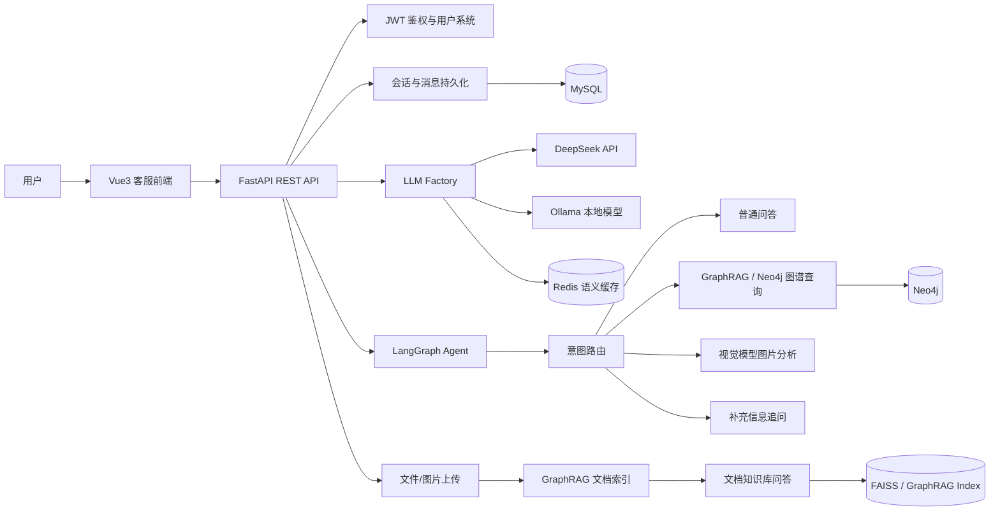

# AssistGen: 面向电商场景的 Agent 智能客服系统

> 一个把「大模型对话」「RAG 知识库」「GraphRAG 图谱问答」「多模态识图」「会话系统」串成完整业务闭环的 AI 客服项目。  
> 项目目标不是做一个简单 ChatBot，而是模拟真实电商客服在售前咨询、商品推荐、图片识别、知识检索和多轮追问中的工作流。

## 项目亮点

- **Agent 路由与多工具编排**：基于 LangGraph 构建查询路由，自动判断普通问答、商品图谱查询、图片理解、补充信息追问等任务类型，并分发到不同处理节点。
- **GraphRAG + Neo4j 商品知识图谱**：围绕电商商品、分类、供应商、订单、评论等实体关系建模，支持自然语言到 Cypher / 预定义查询 / GraphRAG 检索的混合问答。
- **文档知识库问答**：支持 PDF、Word、Markdown、Txt 等文件上传，使用 GraphRAG 构建索引，再通过流式接口进行知识库问答。
- **多模型可切换架构**：通过统一 LLM Factory 屏蔽模型差异，可在 DeepSeek API 与本地 Ollama 模型之间切换，便于在线推理和本地部署。
- **SSE 流式响应体验**：后端 FastAPI 以 `text/event-stream` 输出模型生成内容，前端实现类 ChatGPT 的实时打字效果。
- **图片理解客服能力**：支持用户上传商品图片，调用视觉模型分析图片内容，再结合客服业务逻辑生成回答。
- **工程化能力完整**：包含 JWT 登录鉴权、MySQL 会话持久化、Redis 语义缓存、接口性能指标、统一日志中间件、前后端分离和静态资源部署。

## 在线客服能做什么

| 场景 | 能力 |
| --- | --- |
| 售前咨询 | 回答商品参数、使用场景、库存、价格、推荐理由等问题 |
| 商品推荐 | 结合用户需求，从商品图谱和知识库中检索候选商品 |
| 多轮追问 | 对用户需求不明确的情况主动追问，如预算、品类、使用空间 |
| 图谱问答 | 基于 Neo4j 查询商品、分类、供应商、订单和评论之间的关系 |
| 文档问答 | 上传产品手册、售后说明等文档后进行 RAG 问答 |
| 图片咨询 | 上传商品图片后识别商品信息，并生成客服回复 |
| 通用对话 | 支持普通大模型对话、联网搜索和深度思考模式 |

## 技术栈

**后端**

- FastAPI / Uvicorn
- LangGraph / LangChain
- DeepSeek API / Ollama
- GraphRAG / FAISS / Sentence Transformers
- Neo4j / MySQL / Redis
- SQLAlchemy Async / JWT / Pydantic

**前端**

- Vue 3
- TypeScript
- Vite
- Pinia
- Vue Router
- Axios
- Markdown-it / DOMPurify

## 系统架构



## 核心模块

```text
.
├── backend/deepseek_agent
│   ├── llm_backend
│   │   ├── main.py                         # FastAPI 入口，聊天、RAG、LangGraph、上传等接口
│   │   ├── run.py                          # 后端启动入口
│   │   ├── app/api/auth.py                 # 注册、登录、Token 校验
│   │   ├── app/services/llm_factory.py     # 多模型服务工厂
│   │   ├── app/services/rag_chat_service.py
│   │   ├── app/services/indexing_service.py
│   │   ├── app/services/redis_semantic_cache.py
│   │   ├── app/lg_agent/lg_builder.py      # LangGraph Agent 工作流
│   │   └── app/lg_agent/kg_sub_graph       # 图谱问答与多工具查询
│   └── requirements.txt
└── frontend/DsAgentChat_web
    ├── src/views/Home.vue                  # 主聊天页面
    ├── src/views/EcommerceService.vue      # 电商客服演示页
    ├── src/services/api.ts                 # 前端 API 与 SSE 处理
    └── package.json
```

## 快速启动

### 1. 克隆项目

```bash
git clone <your-repo-url>
cd Code
```

### 2. 启动后端

```bash
cd backend/deepseek_agent
python -m venv .venv
.venv\Scripts\activate
pip install -r requirements.txt

cd llm_backend
python run.py
```

后端默认运行在：

- API 服务：`http://localhost:8000`
- Swagger 文档：`http://localhost:8000/docs`
- 健康检查：`http://localhost:8000/health`
- 指标接口：`http://localhost:8000/metrics`

### 3. 配置环境变量

在 `backend/deepseek_agent/llm_backend/.env` 中配置运行所需变量。下面是最小化示例，请替换为自己的本地服务或 API 配置。

```env
# 模型服务选择：deepseek 或 ollama
CHAT_SERVICE=deepseek
REASON_SERVICE=ollama
AGENT_SERVICE=deepseek

# DeepSeek
DEEPSEEK_API_KEY=your_api_key
DEEPSEEK_BASE_URL=https://api.deepseek.com/v1
DEEPSEEK_MODEL=deepseek-chat

# 视觉模型
VISION_API_KEY=your_vision_api_key
VISION_BASE_URL=https://your-vision-endpoint/v1
VISION_MODEL=your-vision-model

# Ollama
OLLAMA_BASE_URL=http://localhost:11434
OLLAMA_CHAT_MODEL=qwen2.5:7b
OLLAMA_REASON_MODEL=deepseek-r1:7b
OLLAMA_EMBEDDING_MODEL=bge-m3
OLLAMA_AGENT_MODEL=qwen2.5:7b

# 搜索
SERPAPI_KEY=your_serpapi_key
SEARCH_RESULT_COUNT=3

# MySQL
DB_HOST=localhost
DB_PORT=3306
DB_USER=root
DB_PASSWORD=your_password
DB_NAME=assistgen

# Neo4j
NEO4J_URL=bolt://localhost:7687
NEO4J_USERNAME=neo4j
NEO4J_PASSWORD=your_password
NEO4J_DATABASE=neo4j

# Redis
REDIS_HOST=localhost
REDIS_PORT=6379
REDIS_DB=0
REDIS_PASSWORD=
ENABLE_SEMANTIC_CACHE=false

# JWT
SECRET_KEY=replace-with-a-secure-random-string
ACCESS_TOKEN_EXPIRE_MINUTES=30
```

### 4. 启动前端

```bash
cd frontend/DsAgentChat_web
npm install
npm run dev
```

如果需要把前端打包进后端静态目录：

```bash
npm run build
```

然后将生成的 `dist` 内容同步到：

```text
backend/deepseek_agent/llm_backend/static/dist
```

## 关键接口

| 方法 | 路径 | 说明 |
| --- | --- | --- |
| `POST` | `/api/register` | 用户注册 |
| `POST` | `/api/token` | 用户登录并获取 JWT |
| `POST` | `/api/chat` | 普通聊天，SSE 流式返回 |
| `POST` | `/api/reason` | 深度思考模式 |
| `POST` | `/api/search` | 联网搜索增强问答 |
| `POST` | `/api/upload` | 上传文档并构建 GraphRAG 索引 |
| `POST` | `/chat-rag` | 基于文档索引的 RAG 问答 |
| `POST` | `/api/langgraph/query` | LangGraph Agent 查询，支持图片上传 |
| `POST` | `/api/langgraph/resume` | 恢复被中断的 Agent 多轮流程 |
| `GET` | `/metrics` | 查看接口性能指标 |

## 我在这个项目中重点解决的问题

1. **如何让客服不只是调用一个模型，而是根据问题选择工具？**  
   通过 LangGraph 将用户问题先路由，再进入普通问答、图谱查询、图片分析或追问节点，避免所有问题都走同一条 Prompt。

2. **如何把业务知识接入大模型？**  
   使用 Neo4j 建模电商实体关系，并结合 GraphRAG、Cypher 查询和预定义查询，让客服回答可追溯到商品、分类、订单、评论等结构化数据。

3. **如何改善真实聊天体验？**  
   后端使用 SSE 流式输出，前端逐块渲染 Markdown，同时维护用户登录态、历史会话、消息记录和多轮上下文。

4. **如何兼顾成本和部署灵活性？**  
   通过 `LLMFactory` 支持 DeepSeek API 与 Ollama 本地模型切换；Redis 语义缓存用于复用相似问题答案，降低重复推理成本。

## 项目状态

该项目目前更偏向 **AI 应用工程与 Agent/RAG 能力展示**，适合作为后端开发、AI 应用开发、Agent 工程、全栈实习/秋招项目展示。前端主要用于演示完整业务链路，核心亮点集中在后端 Agent 编排、知识检索和多模型服务集成。

## License

MIT
